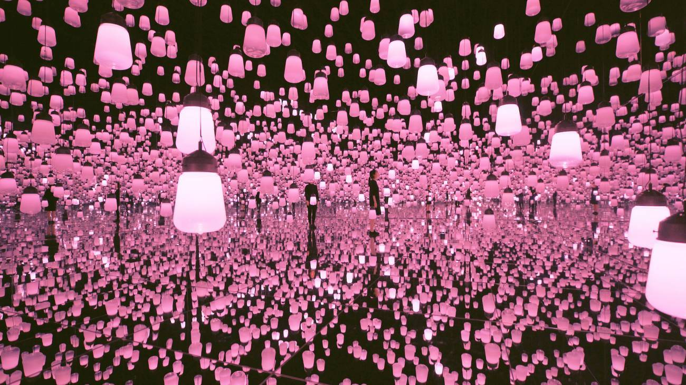
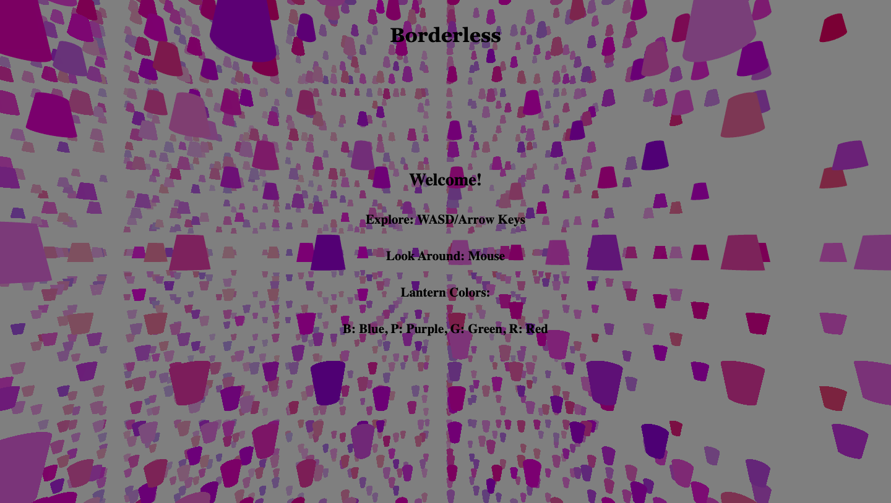
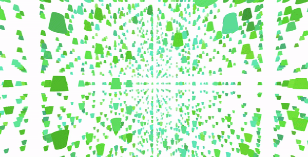
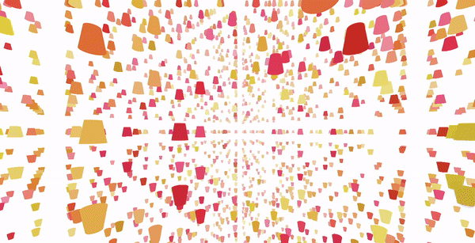

# Borderless

A 3D virtual recreation of teamLab's Forest of Resonating Lamps digital art exhibit. 

# Getting started

1. Clone this repository

   ```git clone git@github.com:Jihyunnk/Borderless.git```

2. Install dependencies

    ```npm install```

3. Start the app using:

	```npm start```
  
 4. Have fun exploring!

# Inspiration



# Demo

### Homepage/Directions



### Explore 


### Blue Lights Display


### Purple Lights Display


### Green Lights Display



### Red Lights Display



### Tech Stack

- HTML
- CSS
- Javascript
- Three.js
